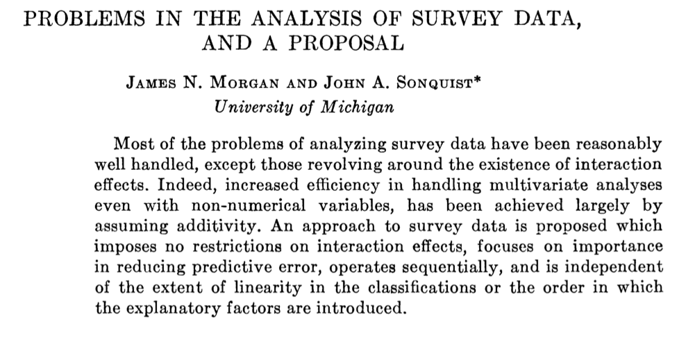
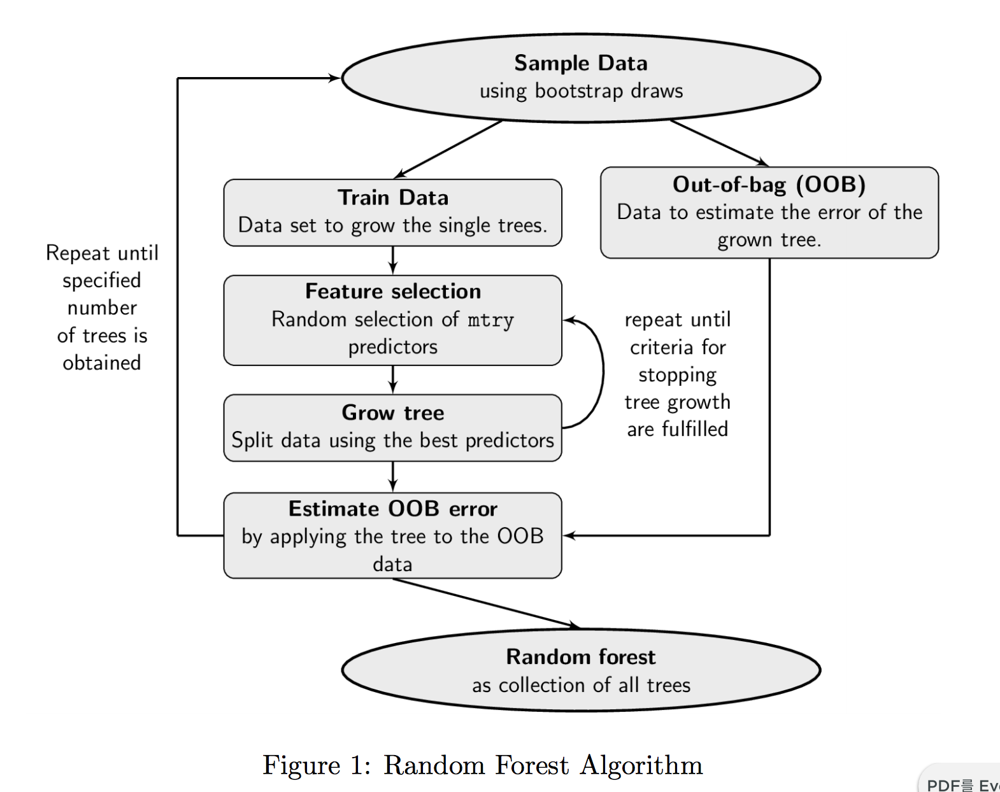
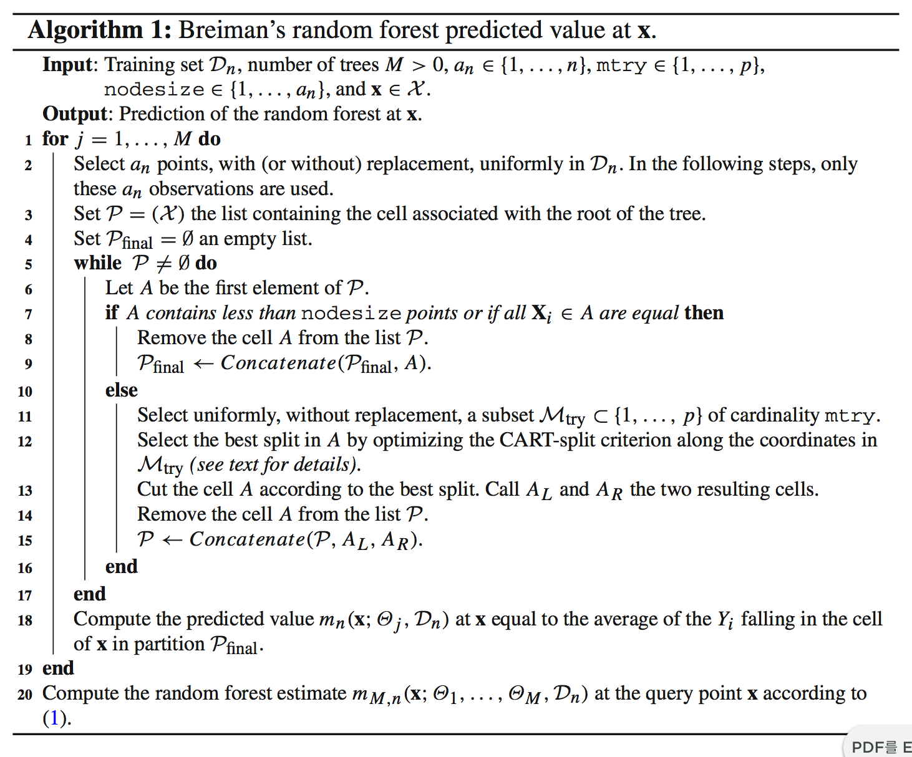

```{r setup, include=FALSE}
knitr::opts_chunk$set(echo = FALSE)
```

# OUTLINE


## OUTLINE - Tree Guided Tour  

  * History of tree-structured models  

  * Tree-structured Models (a.k.a. Decision Tree)  
    + CART  
    + GUIDE including FACT/QUEST/CRUISE/MELT  
    + PARTY  
    + Miscellaneous  
    + Case Studies using R
    
  * Random Forests
    + Bremen’s Random Forests  
    + GUIDE Forests  
    + Random forests with conditional inference  
    + Miscellaneous  
    + Case Studies using R

## OUTLINE -  Trees with Neural Net  

  * Trees as a nonparametric models  
    + Trees as a K-NN 
    + Trees as an additive model  
    + Trees as a neural networks  

  * Neural random forests  

  * Deep neural decision forests  


# Decision Tree Guided Tour


## History 

  

  
  

# Random Forest Guided Tour

## History

  History of Random Forest (RF)


## Breiman's RF Algorithm (2001)

  

## Parameters for RF algorithm

 There are **three** parameters for RF algorithms:

  * $a_n \in \{1, \ldots, n\}$: the number of sampled data points in each tree  
  * $mtry \in \{1, \ldots, p\}$: the number of possible directions for splitting at each node of each tree  
  * $nodesize  \in \{1, \ldots, a_n \}$: the number of examples in each cell below which the cell is not split  

  By default, in the *regression* mode of the `randomForest` package, the parameter  
  `mtry = ceiling(p / 3)`, `a_n = n`, and `nodesize = 5`.

## Breiman's RF Algorithm (2001)

  {
    width: 50%
    background: none;
  }


## Variable Importance

RF can be used to rank the importance of variables via two measures of significance:

  * Gini importance a.k.a Mean Decrease Impurity (Breiman, 2003a)
    + the total decrease in node impurity from splitting on the variablce, averaged over all trees
    + yielding a high DGI when selected, leading to a high Gini VIM.
  * *Permutation Importance* a.k.a. Mean Decrease Accuracy (Breiman, 2001)
    + if the variable is not important, then rearranging its values shold not degrade prediction accuracy.
    + the difference between the OOB error resulting from a data set obtained through random permutation of the predictor of interest and the OOB error resulting from the original dataset.
    + Increase the OOB error, leading to a high permutation VIM

For more detail, see [Goldstein et al. (2014)].

## VIM: MDA

Set ${\bf X} = (X^{(1)}, \ldots, X^{(p)}).$  
For a forest resulting from the aggregation of $M$ trees, the MDI of the variable $X^{(j)}$ is defiend by  
$$ 
\hat{MDI}(X^{(j)}) = \frac{1}{M} \sum_{l = 1}^{M} \sum_{t \in \mathrf{T}_l} p_{n,t} L_{reg, n} (j_{n,t}, z_{n,t}),
$$
where  


## VIM: MDI


# Case Studies using R packages


## Implementations in R

 Tree-structured Models      | Random Forests
---------------------------- | ------------------------
`tree::tree`                 |
`rpart::rpart`               | `randomForest::rf`
`mvpart::mvpart`             | `randomForestSRC`
`party::mob`                 | `Rborist`
`psychotree:psychotree`      | `ranger::ranger`
`betareg::betatree`          | `party::cforest`
`RWeka::M5`                  | `quantregForest::`
`evtree::evtree`             | `LogicForest::`
`REEMtree::REEMtree`         |
`vcrpart::vcrpart`           | 
`melt::melt`                 |

For more details, see `CRAN Task View` 

## DATA: CAR dataset

```{r}
#data(kyphosis)
#head(kyphosis)
```

## rpart

```{r}
library(rpart)
fit <- rpart(Kyphosis ~ Age + Number + Start, data = kyphosis)
fit
plot(fit)
text(fit)
```

## mxnet

```{r, eval = FALSE}
library(mxnet)
X <- kyphosis[,-1]
Y <- kyphosis[,1]

data <- mx.symbol.Variable("data")
fc1 <- mx.symbol.FullyConnected(data, name="fc1", num_hidden=128)
act1 <- mx.symbol.Activation(fc1, name="relu1", act_type="relu")
fc2 <- mx.symbol.FullyConnected(act1, name="fc2", num_hidden=64)
act2 <- mx.symbol.Activation(fc2, name="relu2", act_type="relu")
fc3 <- mx.symbol.FullyConnected(act2, name="fc3", num_hidden=10)
softmax <- mx.symbol.SoftmaxOutput(fc3, name="sm")

devices <- mx.cpu()

mx.set.seed(0)
model <- mx.model.FeedForward.create(softmax, X=X, y=Y,
                                     ctx=devices, num.round=10, array.batch.size=100,
                                     learning.rate=0.07, momentum=0.9,  eval.metric=mx.metric.accuracy,
                                     initializer=mx.init.uniform(0.07),
                                     epoch.end.callback=mx.callback.log.train.metric(100))

```


## DATA: CAR Data


[See Lending Club](https://www.lendingclub.com/)

## DATA: Lending Club Loan Data


[See Lending Club Loan Data](https://www.lendingclub.com/info/statistics.action)

## DATA: Lending Club Loan Data


# Trees with Relationship to Other Methods


## Trees as a Nearest Neighbors


For more detail, See[Lin and Jeon (2006)]().

## Trees as a nonparametric models  


## Neural random forests  


## Deep neural decision forests  


